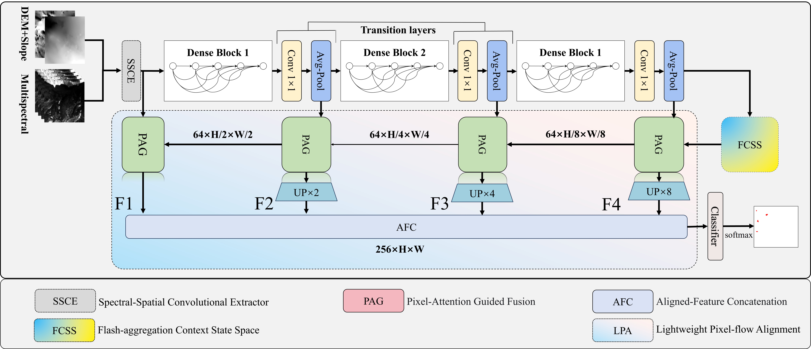

# Lightweight Spectral-Spatial Landslide Identification Network for Multispectral Remote Sensing Imagery
# related model
Models and articles related to this paper—if they are helpful to your research, remember to cite their articles.  
1.MFFEnet  paper url: https://link.springer.com/article/10.1007/s10346-022-01847-1  

2.MIM_ISTD  paper url: https://ieeexplore.ieee.org/document/10740056  

3.MS2LandsNet paper url: https://www.tandfonline.com/doi/full/10.1080/17538947.2023.2300731  

4.RIPF_Unet paper url: https://link.springer.com/article/10.1007/s11069-023-06145-0  

5.Pyramidmamba  paper url:  http://arxiv.org/abs/2406.10828  

6.Bisdenet paper url:  [http://arxiv.org/abs/2406.10828](https://ieeexplore.ieee.org/document/10384668)  

7.TransUnet2  paper url: https://ieeexplore.ieee.org/abstract/document/11002703  

8.BFA_ResUnet paper url: https://www.mdpi.com/2072-4292/17/6/995  

9.SCDUnetPP  paper url: https://www.sciencedirect.com/science/article/pii/S1569843223004363

# Installation

💾 Clone this repository to your local machine.

```bash
https://github.com/ZeroIsStar/CSSL-Net.git
cd CSSL-Net
```
## 📦 环境依赖

### 核心依赖
```txt
# 深度学习框架
torch==2.0.0+cu118
torchvision==0.15.1+cu118
timm==1.0.24

# 计算机视觉
opencv-python==4.11.0.86
Pillow==9.4.0
tifffile==2023.7.10
mamba-ssm==2.2.2

# 数据处理与科学计算
numpy==1.24.2
scipy==1.10.1
matplotlib==3.7.1
pandas==2.0.0
h5py==3.11.0

# 模型评估与工具
tensorboard==2.12.0
thop==0.1.1.post2209072238
torchsummary==1.5.1
einops==0.8.1
```
# Training Process Monitoring
```bash
tensorboard --logdir=tf-logs
```

<div align="center">
  
  <br>
  <em>图1: 整体系统架构图</em>
</div>


